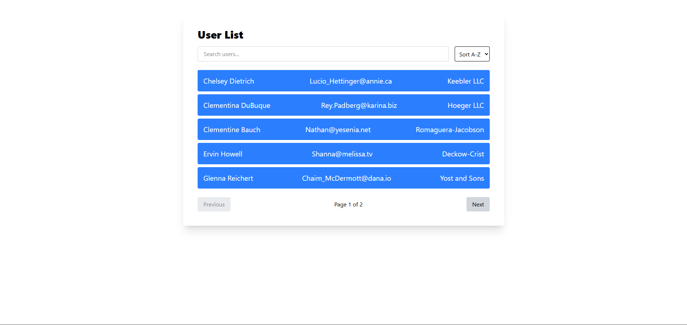

# URL Fetch and Searching

Implemented the UseEffect function to fetch the content from open API and then implemented a Search Functionality
---

---
# Demo / Preview 


## Tech Stack

**Client:** React / Tailwindcss / HTML and Javascript.


### Prerequisites

- Node.js 
- Package manager (npm, pip, yarn, etc.)

### Installation

```bash
# Clone the repository
git clone https://github.com/adityakalra007/URLFetch-and-Search

# Move into the project folder
cd URLFetch-and-Search

# Install dependencies
npm install  

# Start the project
npm start  